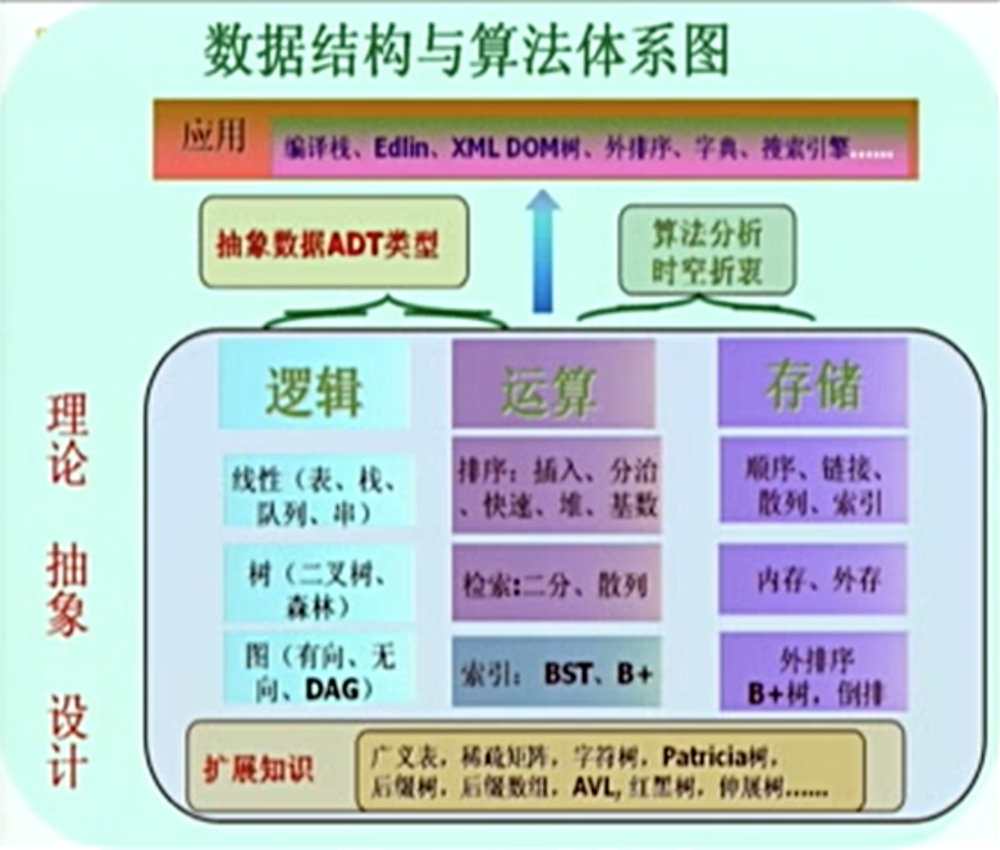

# 数据结构与算法

刚开始学程序设计的时候，对程序的认知不足。自以为程序就是有一个目标，向着目标，心有所想，有感而发，达到目的，程序就成了。随着编写程序的编写，对程序的认识也不断加深。才深深认识到 “程序 = 数据结构 + 算法” 才是程序的真谛。 然而，学的过程中，很容易忘，故做笔记以记之。

程序的作用，到底是为人服务的，就是将给人看的数据，或者服务于的数据处理成可以被人看懂，或者有效的数据。而这些数据从原始的获取，到处理过程，到处理结果。都有一定的结构，才能方便的处理。这就是数据结构作用。

> 数据结构：是相互之间存在一种或多种特定关系的数据元素的集合

Data Structure  = (D, S)
其中：D 是数据元素的有限集，S 是 D 上关系的有限集。

而将数据从一中结构转化为另一种结构，或者得到一组数据处理成另一组结构的程序，就是算法了。

数据结构和算法是分不开的两部分，数据结构虽然简单，可研究的内容也比较少，但是数据结构是算法的基础，直接影响到算法的设计，实现和是否简单。数据结构设计的目的就是为了算法，没有算法的数据结构没有任何作用。数据结构和算法的关系就像地基与高楼，高楼千变万化，地基也就集中形式；研究设计高楼者众，没有好的地基，也盖不出稳固的楼层。

数据结构占的空间：算法运行耗时间。这就是是程序设计的考量点，在空间复杂度和时间复杂度之间取舍。

Accidentally I've stumbled upon the following quote by Linus Torvalds:

"Bad programmers worry about the code. Good programmers worry about data structures and their relationships."

事实上，数据结构和算法的取舍方面，人们一直偏向于优秀的数据结构和简单的算法，因为代码最终是由人来维护和优化，很大程度上来说，是给人看的。

计算机科学就是“一种关于信息结构转换的科学”（Wegnor）—— 从一个方面指出了计算机科学其实是数据结构之间转换的科学。
计算机科学是“算法的学问” （D.Knuth）

其实，数据结构和算法是相互依存的。

数据结构 = 逻辑结构 + 存储结构 + 运算

### 逻辑结构

图 > 树 > 二叉树 > 线性表

## 数据结构分类

逻辑结构：

- 集合
- 线性结构
    - 线性表
    - 栈和队列
    - 串
    - 数组和广义表
- 树形机构
- 图状（网状）结构

存储结构：

- 顺序结构
- 链式结构

索引方法（顺序结构的一种）
散列方法（顺序结构的一种）

算法的设计 --依赖--> 数据逻辑结构
算法的实现(还有度量) --依赖--> 数据存储结构

## 数据的运算

增，删，查，改
排序，检索

其中，查在增删查改中占有着重要的地位，很多有序的增，删，改都是以查为前提的。

## 算法

算法是对特定问题的求解步骤一种描述。它具有如下特性

- 又穷性：步骤又穷，时间有穷
- 确定性：无歧义，在任何条件下，只有唯一的一条执行路径。
- 可行性：算法中描述的操作都可以使用现有的运算来实现
- 输入： 零个或多个输入
- 输出：一个或多个输出

算法分类

- 穷举法(百钱买百鸡) —— 万能，低效
  避免穷举测试
- 回溯（迷宫，八皇后），搜索（DFS，BFS）
 —— 跳过无解分支
 最优化问题的通法
- 递归分治（二分检索，快速排序，分治排序）
 —— 自定向下，问题化解
 子结构不重复
 分，治，解

- 动态规划（Floyd算法）—— 自底向上，利用中间结果，快速构造
 最优子结构，重复子结构，无后效性
 搜索中分支定界的特例
 空间换时间

- 贪心算法（Huffman 最短编码，Dijkstra 最短路径）—— 动态规划的特例
 最优子结构——最优解
 否则，只是快速得到较优解

### 算法设计的要求

- 正确性
- 可读性
- 健壮性
- 效率与低存储量需求

### 算法效率和空间度量

